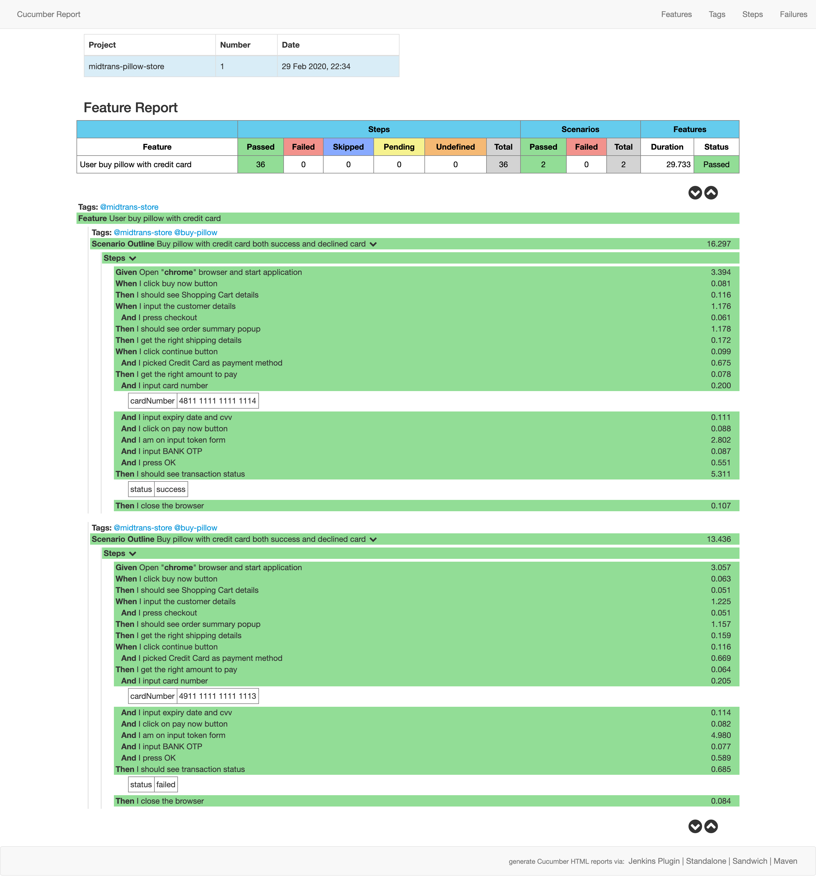

# Midtrans-Store
This automation script will automate purchasing process of a product from checkout -> select payment method -> payment details entry -> TFA -> success/fail payment state

## Run the test
`mvn test verify`

## Result
Test result can be found in `target/result/cucumber-html-reports/overview-features.html`

## Feature
Instead using multiple scenario, I decided to put all the case into one scenario that will runs both positive and negative case using `Scenario Outline` such as:

`Then I should see transaction status`

	Examples:
      | cardNumber          | transactionStatus |
      | 4811 1111 1111 1114 |       success     |
      | 4911 1111 1111 1113 |       failed      |

## Language and Syntax
- Java 1.8.0_181
- Gherkin

## Depedencies
Managed with Maven
- [Cucumber-Java](https://mvnrepository.com/artifact/io.cucumber/cucumber-java/2.3.0)
- [Cucumber-Junit](https://mvnrepository.com/artifact/io.cucumber/cucumber-junit/2.3.1)
- [Selenium](https://mvnrepository.com/artifact/org.seleniumhq.selenium/selenium-java/3.141.59)
- [

## Plugin
This cucumber reporting page is using [Masterthought](https://github.com/damianszczepanik/cucumber-reporting)

## Issues
- [StaleElementReferenceException: ](https://www.selenium.dev/selenium/docs/api/java/org/openqa/selenium/StaleElementReferenceException.html) happen when trying to assert transaction status (success/fail) after submitting OTP. **(fixed)**

	- Fixed by reassigning iframe object
- [Can't access dead object: ](https://blog.mozilla.org/addons/2012/09/12/what-does-cant-access-dead-object-mean/#comment-163798) This might be Firefox - Selenium incompatibility issue. The behviour on newer Firefox version disallow add-ons to keep references to DOM objects after their parent document was destroyed. Rolling back to Firefox 12.0 fixes the issue.

- Couldn't find element `//input[@type='password']` on OTP Screen: Turns out it's inside nested iframe **(fixed)**

- `org.openqa.selenium.WebDriverException: unknown error: cannot determine loading status`: Sometimes in steps `And I am on input token form` that require to switch frames, this issue occurs. This is intermittent issue and it's reported [here](https://github.com/SeleniumHQ/selenium/issues/5609)

## What can be improve
- Use property file to store locators
- Webdriver and Webelement object initialization
- Assertion for transition page between input credit card details and OTP token (the race condition makes it difficult)
- Assertion for transition page between and OTP token and payment success message (also race condition)

## Note
If find logs for remote repository in this file, please ignore it. It was because while I'm in the middle of working this solution, I forgot not to push the work into my **private** remote repository. So after that I stopped pushing and immediately DELETE it. This might be due to my habit and anxiety to lose the work. Thank you for your understanding.
